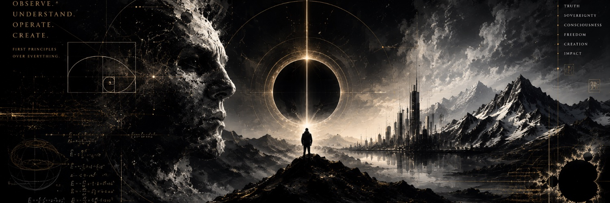

  

<h1 align="center">Brandelbrot</h1>

<strong>AI. Development. Consciousness.</strong>

Observe deeply. Build deliberately. Keep exploring.

<a href="https://x.com/brandelbrotx">Thoughts & experiments on X ↗</a>

---

I'm Brandon. I build practical software and explore how AI changes the way we learn, create, and understand ourselves.

My work spans local-first Mac utilities, research and audio workflows, computer vision, and interactive experiences. I care about useful tools, honest limits, and keeping people in control of their data.

### What interests me

- **AI that earns its place** — matching the model to the work, from deep reasoning to fast iteration.
- **Tools for everyday friction** — turning something I repeatedly need into something others can use.
- **Understanding and consciousness** — exploring the questions alongside building the software.

### Building in the open

I'm preparing selected projects for public release, with clear setup instructions, reproducible examples, and explicit limitations. This profile will grow with the projects as they become available.

If a tool helps you, tell me how you use it—or what would make it better.

Curiosity → experiments → useful software

